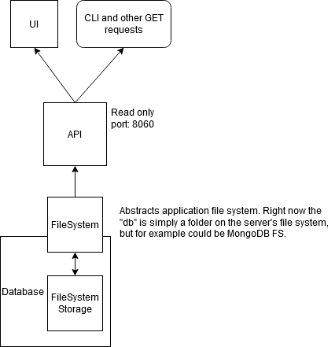

This is a simple application to demonstrate browsing and displaying image data from a file system.
The author retains copyright to included images.

## Setup

`yarn` or `yarn install`

*Application has been tested with...*
- node v14.0.0
- npm 6.14.4
- yarn 1.22.4
- Windows 10 1703

## Run

yarn or npm

`npm run api`

`npm run ui`

## Architecture

This project was built from [Create React App](https://github.com/facebook/create-react-app) and express generator `npx express-generator`. Other than that it's more or less built from scratch.

## Possible Improvements

- See notes on data structure and API, cleanup classes and minor refactoring
- Support differnt file formats
- API design, full CRUD, multi-tenant, GraphQL or REST, etc.
- Tests (unit, func, and/or e2e) + static code analysis
- Improve monorepo, project structure, webpack, linting rules, etc.
- Database, serverless?
- Containerize
- DevOps, build and deployments
- Performance: pagination, caching, polling, webhooks, 